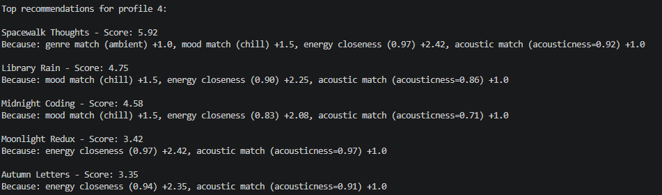
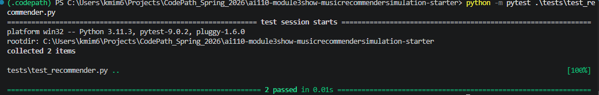

# 🎧 Model Card: Music Recommender Simulation

## 1. Model Name  

Give your model a short, descriptive name.  
Example: **SoundFit 1.0**  

---

## 2. Intended Use  

Describe what your recommender is designed to do and who it is for. 

Prompts:  

- What kind of recommendations does it generate  
- What assumptions does it make about the user  
- Is this for real users or classroom exploration  

My recommender is a designed to recommmend songs using conten-based filtering, based on user's taste profile. Given a user's preferred genre, mood, target energy level, and acoustic preference, it scores every song in the catalog and returns the top k closest matches.

It assumes the user only prefers one type of genre and they are a casual listener. The user knows what kind of songs they like and don't want to manually search for it. It also doesn't allow exploration of different type of songs from variety of genres. 

This is for classroom exploration to learn how recommendation work. Real users want much more variety of content and wants to be updated with the new songs coming out everyday. 

---

## 3. How the Model Works  

Explain your scoring approach in simple language.  

Prompts:  

- What features of each song are used (genre, energy, mood, etc.)  
- What user preferences are considered  
- How does the model turn those into a score  
- What changes did you make from the starter logic  

Avoid code here. Pretend you are explaining the idea to a friend who does not program.

I defined taste profile to include the user's favorite genre, mood, target energy, and whether or not they like acoustic.

In the user's taste profile, I considered user's preference for genre, energy level, mood, and if they like acoustic.

I used those information to calculate score.

      score = genre_match (0 or 1)          × 2.0   ← binary, high weight
      + mood_match  (0 or 1)          × 1.5
      + energy_closeness              × 1.0   ← 1 - |user.target_energy - song.energy|
      + acoustic_match                × 1.0   ← if likes_acoustic and acousticness > 0.6

The genre has the highest impact; it's multiplied by 2. Then, mood has the second highest priority; it's multiplied by 1.5. Both song's energy closeness to the user's target energy and if they like acoustic get bonus point multiplied by 1. 

---

## 4. Data  

Describe the dataset the model uses.  

Prompts:  

- How many songs are in the catalog  
<!-- - What genres or moods are represented  eN
     -->
- Did you add or remove data  
- Are there parts of musical taste missing in the dataset  

There were 10 songs in the base songs.csv file and I added 10 more songs--total 20. There are varieties of genres like pop, lofi, jazz, rock, etc and moods as well such as happy, chill, intense, and relaxed. 

Attributes of a song like artist, year released, and if the song is trendy/popular are missing from the dataset 

---

## 5. Strengths  

Where does your system seem to work well  

Prompts:  

- User types for which it gives reasonable results  
- Any patterns you think your scoring captures correctly  
- Cases where the recommendations matched your intuition 

My system seem to work well for user taste profile that is straightforward like rock and high energy or lofi and low energy. If all the 4 attributes I chose aligns well, for example, lofi, low energy, chill, and likes acoustic, versus a taste profile rock, intense, high energy, and doesn't like acoustic are well separated. 

This profile matched the output quite well. 
 {"genre": "ambient","mood": "chill",   "energy": 0.25, "likes_acoustic": True}

---

## 6. Limitations and Bias 

Where the system struggles or behaves unfairly. 

Prompts:  

- Features it does not consider  
- Genres or moods that are underrepresented  
- Cases where the system overfits to one preference  
- Ways the scoring might unintentionally favor some users  

The system struggles the most in the mixed profile like when the user's favorite genre is chill, but doesn't like acoustic. The feature it doesn't consider is tempo. A user who loves the same genre and have the same energy level can score the same, but their preferance for song tempo could be different, which is correlated to the feel of the song. It doesn't record the listening history like the songs they liked or skipped for context; the profile doesn't update. It will almost always recommend the same songs every time. 

Genres such as r&b, classical, country,, indie pop, etc appear only once and are underrepresented; genere like k-pop and trap are missing altogether. Moods such as uplifting, energetic, peaceful, melancholy, sad, etc are represted only once. 

Because genre is multiplied by 2.0, it has the highest weight. It outscores a perfect match of other categories like energy and acoustic. A different-than-preferred genre with perfect match in other 3 categories will tie but can't beat genre match with nothing much in common. 

People who like acoustic can earn as high as 5.5, but non-acoustic listeners are capped at 4.5. It works is favor for users whose mood aligns with energy because these attributes reinforce each other in the data. 

When I changed the score rule to: double the importance of energy and half the importance of genre, this is the result I got for profile 1 and 2

It heavily favored songs with energy match with the user's target energy. 
---

## 7. Evaluation  

How you checked whether the recommender behaved as expected. 

Prompts:  

- Which user profiles you tested  
- What you looked for in the recommendations  
- What surprised you  
- Any simple tests or comparisons you ran  

No need for numeric metrics unless you created some.

I ran the main.py to experiment what the recommendation returns and see if it matches my intuition of songs it would return. It was quite close with heavy focus on matching genre. The user with lofi genre preference and doesn't like acoustic surprised me the most. I compared my first scoring ruling with the experiment scoring rule, they were quite similar except for some reshuffling of the order. 

Before chaning scoring rule: 

After changing the rule:

I ran the tests using pytest the both tests passed 

---

## 8. Future Work  

Ideas for how you would improve the model next.  

Prompts:  

- Additional features or preferences  
- Better ways to explain recommendations  
- Improving diversity among the top results  
- Handling more complex user tastes  

I would add tempo in the calculation and add more attributes of the song like favorite artist, the era they listen to the most, etc. 

I would just give a brief 1 sentence explanation of the recommendations 

I would penalize artist whose song appear more than once.

More complex taste profile will be difficult, but adding more features would make take us closer and tracking their listening history should help a lot. 
---

## 9. Personal Reflection  

A few sentences about your experience.  

Prompts:  

- What you learned about recommender systems  
- Something unexpected or interesting you discovered  
- How this changed the way you think about music recommendation apps  

I learned how a recommendation system uses two different rule like scoring rule and ranking rule. I also learned how songs are weighted differently depending on the user. 

Something unexpected I discovered is how apps like Spotify and YouTube personalize recommendation yet add so much variety. 
